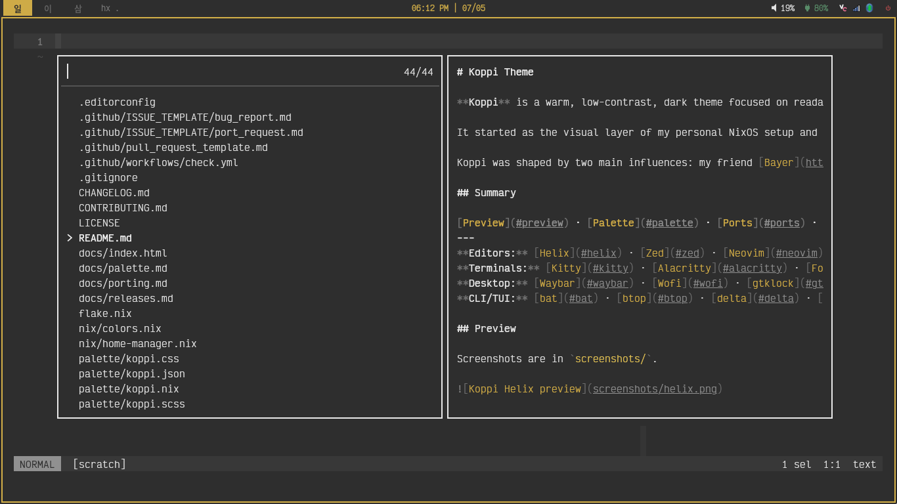

# Koppi Theme

**Koppi** is a warm, low-contrast, dark theme focused on readability and cohesive Wayland desktop integration.

It started as the visual layer of my personal NixOS setup and is being split into a standalone, reproducible theme project.

Two key influences shaped Koppi: Bayer (my friend) and Rust.

## Preview

Screenshots are in `screenshots/`.



## Palette

| Name       | Hex       |
| ---------- | --------- |
| `bg`       | `#2e2e2e` |
| `bg1`      | `#383838` |
| `bg2`      | `#434343` |
| `bg3`      | `#535353` |
| `bg4`      | `#646464` |
| `bgLine`   | `#353535` |
| `bgIndent` | `#3a3a3a` |
| `bgDim`    | `#404040` |
| `bgSelect` | `#4e4e4e` |
| `fg`       | `#e8e8e8` |
| `fgMuted`  | `#909090` |
| `fgSubtle` | `#707070` |
| `fgHint`   | `#606060` |
| `accent`   | `#d4b048` |
| `accdim`   | `#8a7020` |
| `accbrt`   | `#e8c858` |
| `acchigh`  | `#f0d060` |
| `red`      | `#b54a4a` |
| `green`    | `#5a8f6a` |
| `warning`  | `#c4924a` |

The canonical palette is available in:

* `palette/koppi.json`
* `palette/koppi.nix`

## Ports

| App     | Status    | File                      |
| ------- | --------- | ------------------------- |
| Helix   | Available | `ports/helix/koppi.toml`  |
| Zed     | Available | `ports/zed/koppi.json`    |
| Kitty   | Available | `ports/kitty/koppi.conf`  |
| Waybar  | Available | `ports/waybar/koppi.css`  |
| Wofi    | Available | `ports/wofi/koppi.css`    |
| gtklock | Available | `ports/gtklock/koppi.css` |
| ReGreet | Initial   | `ports/regreet/koppi.css` |

## Installation

### Helix

```bash
mkdir -p ~/.config/helix/themes
cp ports/helix/koppi.toml ~/.config/helix/themes/koppi.toml
```

Then set:

```toml
theme = "koppi"
```

### Zed

```bash
mkdir -p ~/.config/zed/themes
cp ports/zed/koppi.json ~/.config/zed/themes/koppi.json
```

Then select `Koppi` from Zed's theme selector.

### Kitty

```bash
mkdir -p ~/.config/kitty
cp ports/kitty/koppi.conf ~/.config/kitty/koppi.conf
```

Then include it in `kitty.conf`:

```conf
include koppi.conf
```

### Waybar

```bash
mkdir -p ~/.config/waybar
cp ports/waybar/koppi.css ~/.config/waybar/style.css
```

### Wofi

```bash
mkdir -p ~/.config/wofi
cp ports/wofi/koppi.css ~/.config/wofi/style.css
```

### gtklock

```bash
mkdir -p ~/.config/gtklock
cp ports/gtklock/koppi.css ~/.config/gtklock/style.css
```

## Nix usage

This repository exposes the Koppi palette as a flake output:

```nix
inputs.koppi-theme.url = "github:amauri/koppi-theme";
```

Then:

```nix
colors = inputs.koppi-theme.lib.colors;
```

## Philosophy

Koppi is:

* dark;
* warm;
* muted;
* low to medium contrast;
* readable for long sessions;
* designed for editor and Wayland desktop cohesion.

Koppi is what I want to feel when I'm working in a WM environment.

## Roadmap

* [x] Add screenshots.
* [ ] Stabilize palette names.
* [ ] Add more terminal ports.
* [ ] Add Neovim port.
* [ ] Add VS Code port.
* [ ] Add Home Manager modules.
* [ ] Consider GTK/libadwaita support later.

## License

MIT.
